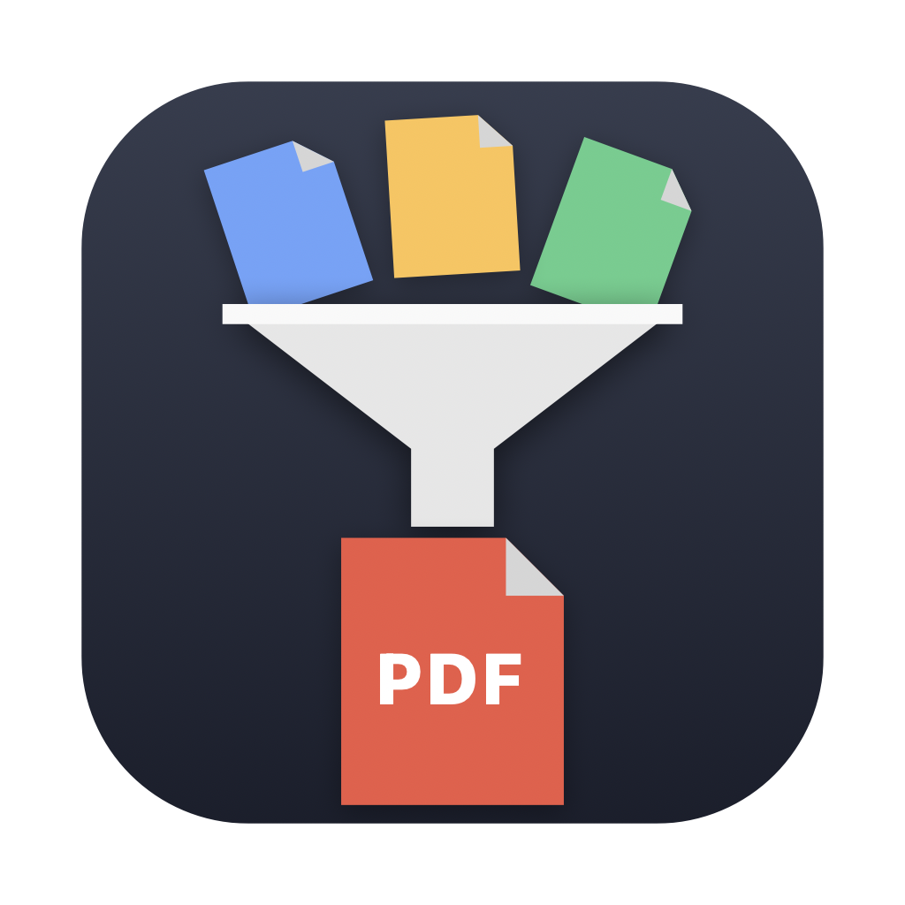

<p align="center">
  
</p>

<h1 align="center">Porter</h1>

<p align="center">
  Drop anything. Get a PDF.<br>
  <em>A native macOS converter with perfect fidelity for Word documents — including legacy <code>.doc</code> files.</em>
</p>

---

Porter converts almost any document to PDF by driving the **real applications**
(Microsoft Word, Excel, PowerPoint, Pages, Keynote, Numbers) as conversion
engines — so a 1998 `.doc` renders exactly as Word renders it. Images, text,
Markdown, and HTML convert with built-in engines that need nothing installed.

## Install

### Download (easiest)

1. Grab `Porter.dmg` from the [latest release](../../releases/latest)
2. Open it and drag **Porter** to **Applications**
3. First launch: **right-click the app → Open** (it's not notarized, so macOS
   asks once)
4. When converting your first Office document, macOS asks *"Porter would like
   to control Microsoft Word"* — click **OK** (once per engine)

### Build from source

Requires only the Xcode Command Line Tools (`xcode-select --install`):

```sh
make build     # builds build/Porter.app + build/Porter.dmg (universal binary)
make install   # installs to /Applications, adds the `porter` CLI, launches
```

## Four ways to convert

1. **Drop window** — drag files (or whole folders) onto the app
2. **Drop folder** — anything dropped into `~/Desktop/PDF Drop` becomes a PDF
   automatically, even with the window closed
3. **Right-click** — in Finder: **Quick Actions → Convert to PDF**
   (installed automatically on first launch)
4. **Terminal** —

   ```sh
   porter report.docx                     # PDF appears next to the file
   porter -o ~/Desktop *.docx *.xlsx      # convert a batch into one folder
   porter --help
   ```

   `make install` links `porter` into `/usr/local/bin`. If you skipped it:

   ```sh
   sudo ln -sf "/Applications/Porter.app/Contents/MacOS/Porter" /usr/local/bin/porter
   ```

## Supported formats

| Kind | Extensions | Engine |
|---|---|---|
| Word | `doc` `docx` `docm` `dot` `dotx` `rtf` `odt` | Microsoft Word → LibreOffice → native fallback |
| Spreadsheets | `xls` `xlsx` `xlsm` `ods` `csv` | Microsoft Excel → LibreOffice |
| Presentations | `ppt` `pptx` `pptm` `odp` | Microsoft PowerPoint → LibreOffice |
| iWork | `pages` `numbers` `key` | Pages / Numbers / Keynote |
| Images | `png` `jpg` `heic` `tiff` `gif` `bmp` `webp` … | built-in (multi-page TIFF → multi-page PDF) |
| Text | `txt` `md` `markdown` `log` `rtfd` | built-in |
| Web | `html` `htm` `xhtml` | built-in |

Engines are picked automatically based on what's installed. None of
Office/iWork/LibreOffice is strictly required — but Word is what makes old
`.doc` conversion pixel-perfect.

**Google Docs/Sheets/Slides**: export from Google first (File → Download →
Word/Excel/PowerPoint or PDF) and convert that. `.gdoc`/`.gsheet`/`.gslides`
files synced by Google Drive are just links to the cloud — they contain no
document data, so no local app can convert them; Porter detects them and
explains this instead of failing cryptically.

## Settings (gear icon in the app)

- Save PDFs next to the original, or all into one folder
- Change / disable the watched drop folder
- Reveal in Finder after converting
- Reinstall the right-click Quick Action

## Development

```sh
make build         # build app + DMG (universal binary)
make install       # install to /Applications + `porter` CLI
make test          # full suite, incl. Word/Excel/PowerPoint engines
make test-native   # native engines only — this is what CI runs
make clean
```

The full `make test` needs a Mac with Microsoft Office (it converts real
legacy `.doc`/`.xls` fixtures through the actual apps). CI runs
`make test-native` on every push ([`ci.yml`](.github/workflows/ci.yml))
because GitHub's macOS runners have no Office installed.

## Releasing (maintainers)

Tag a version — [`release.yml`](.github/workflows/release.yml) builds the
universal app, runs the native tests, and attaches the DMG to a GitHub
Release:

```sh
git tag v1.0.0
git push origin v1.0.0
```


## License

[MIT](LICENSE)
